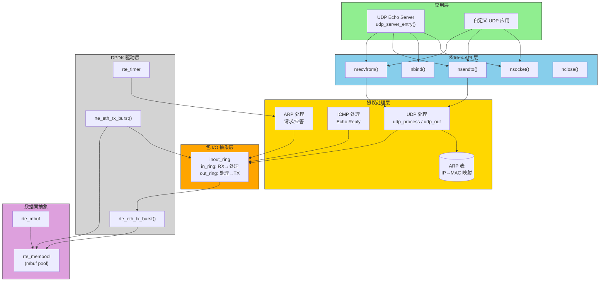
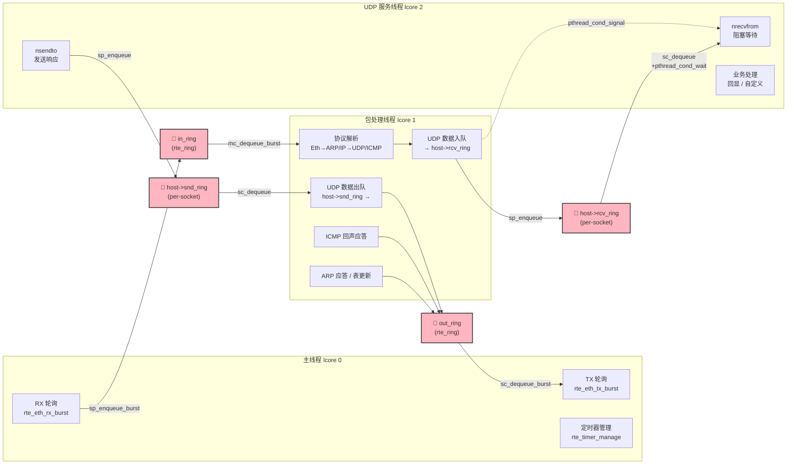
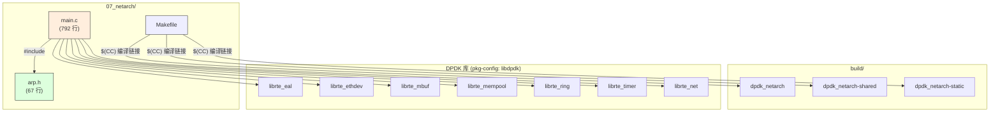
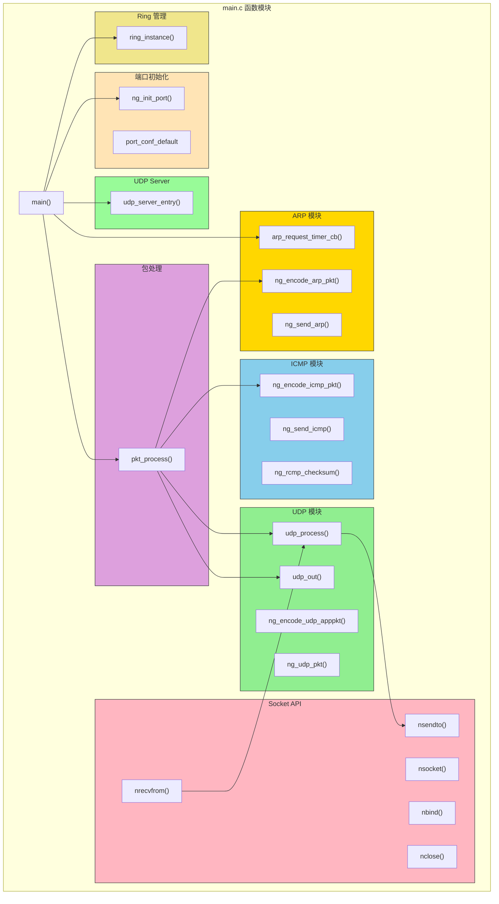
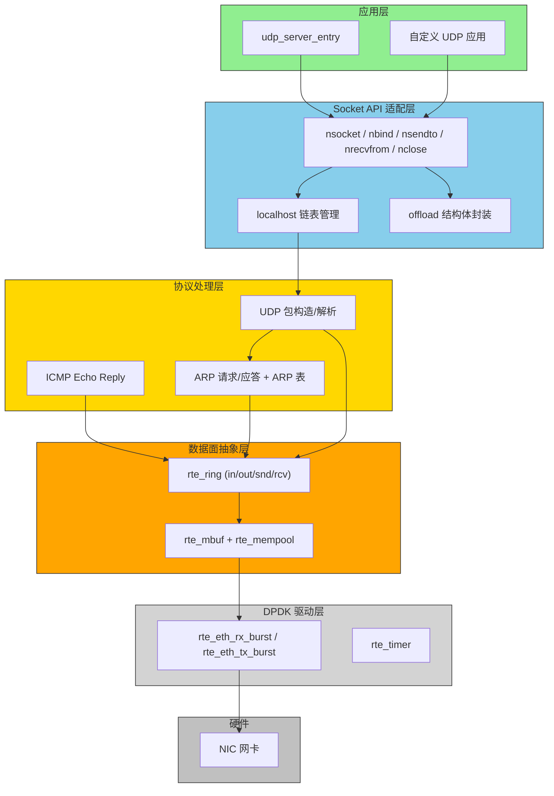
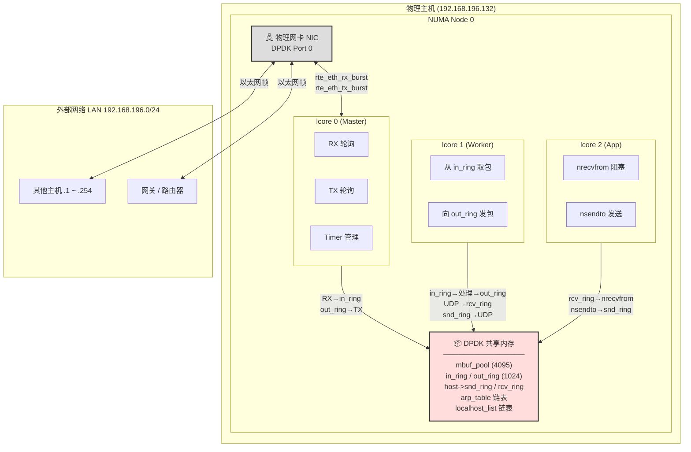
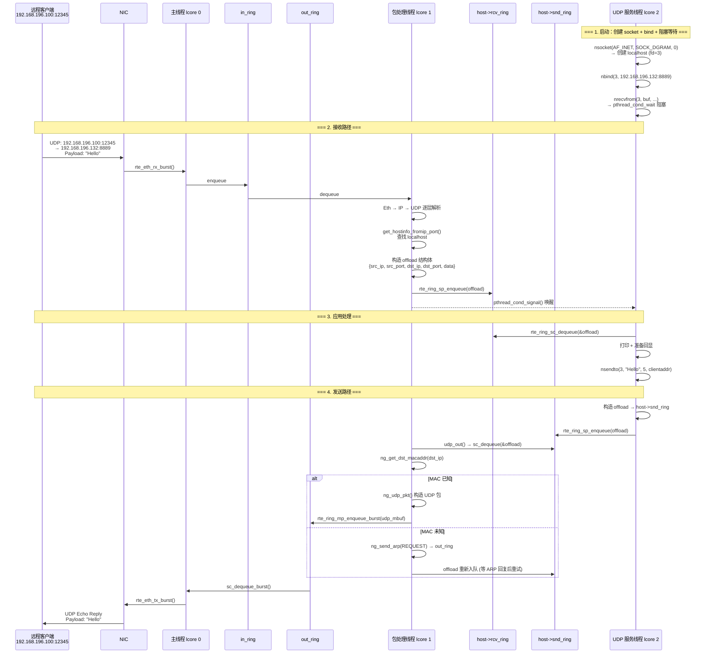
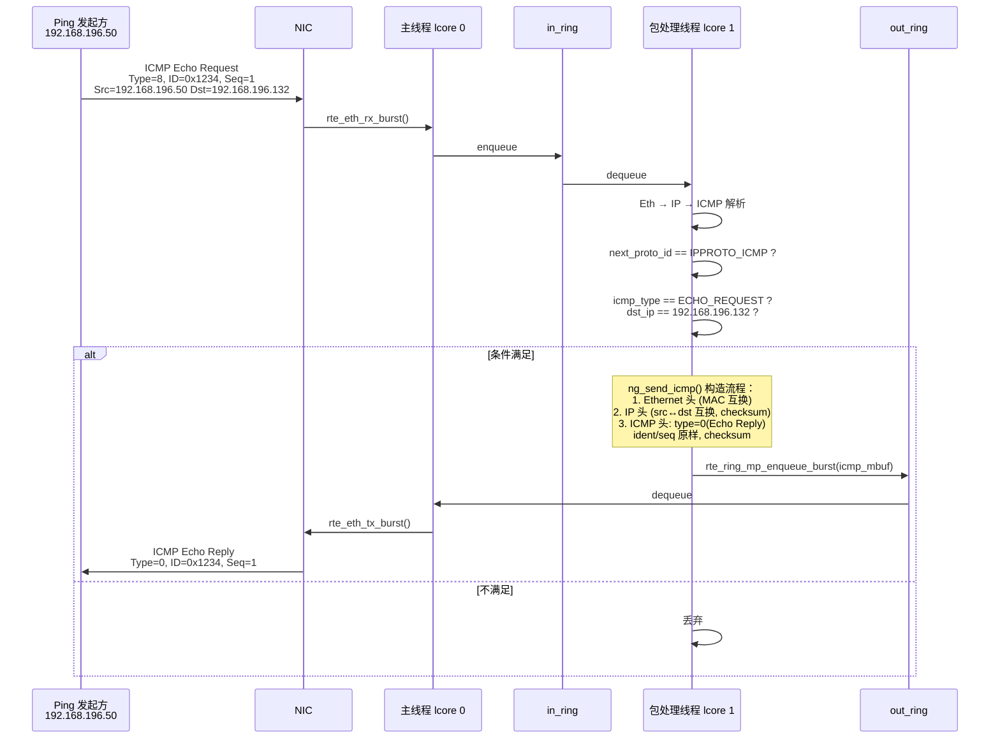
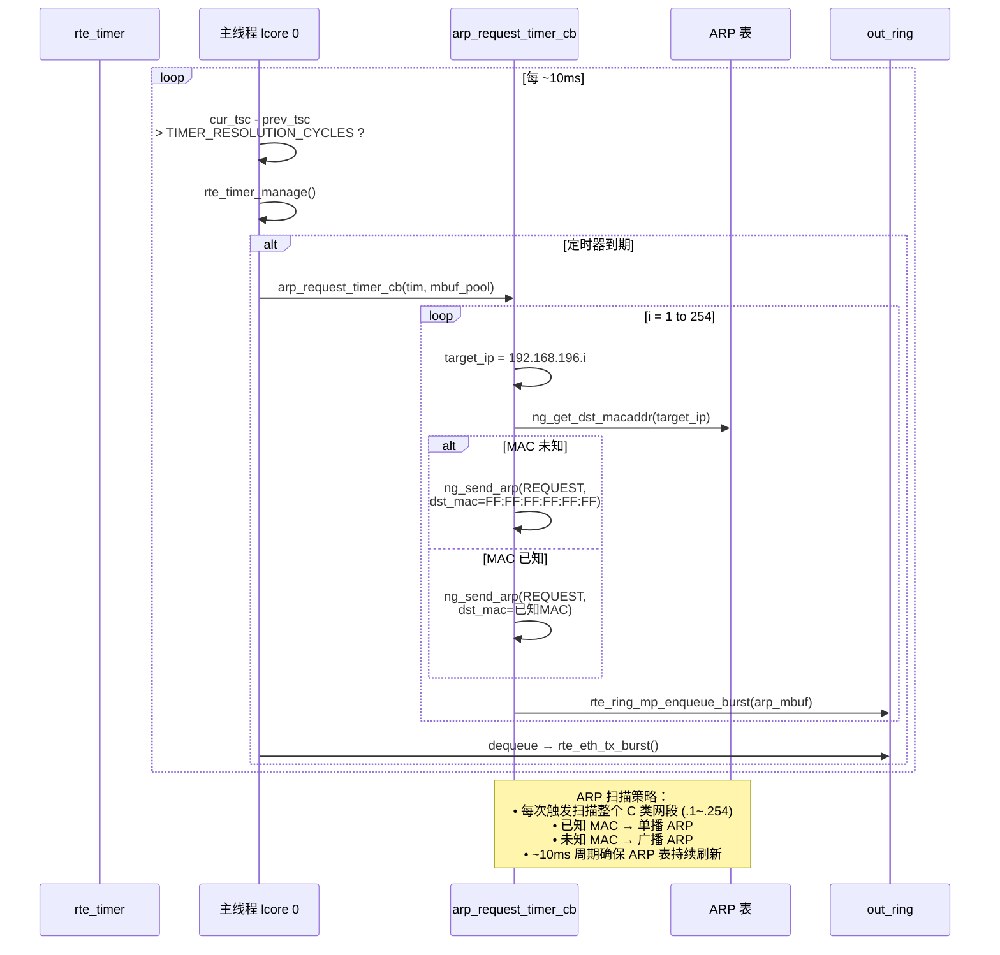
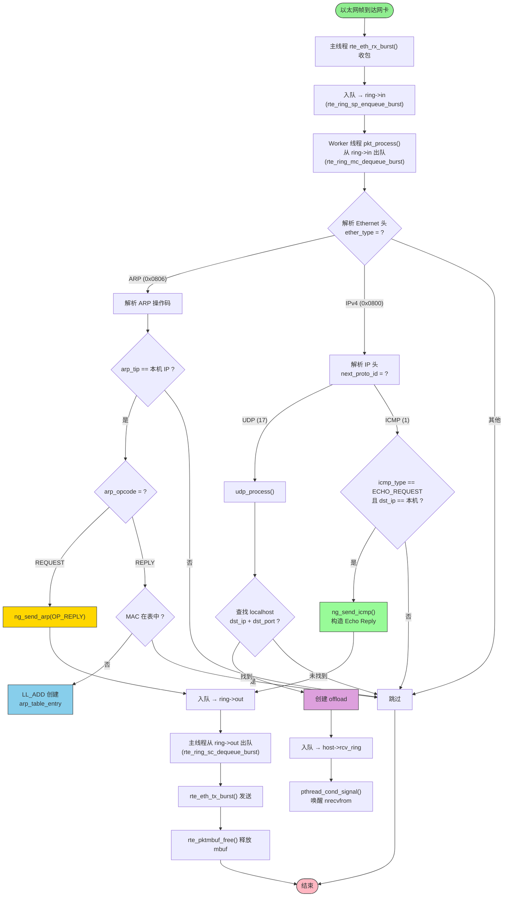

# DPDK 网络协议栈架构文档 (07_netarch)

## 项目概述

`07_netarch` 是一个基于 **DPDK 19.08.2** 实现的用户态轻量级网络协议栈。它在 DPDK 的轮询模式驱动（PMD）之上，直接从网卡收发以太网帧，在用户态实现了 **ARP**、**ICMP** 和 **UDP** 协议的处理，并向上层提供了类 BSD Socket 的编程接口（`nsocket` / `nbind` / `nsendto` / `nrecvfrom` / `nclose`）。

编译产物为 `dpdk_netarch`，支持 shared/static 两种链接方式。

---

## 编译开关一览

代码通过宏开关控制功能模块，全部定义在 [main.c](main.c#L14-L22)：

| 宏 | 含义 |
|---|---|
| `ENABLE_SEND` | 启用发送功能（TX queue 配置） |
| `ENABLE_ARP` | 启用 ARP 包处理 |
| `ENABLE_ICMP` | 启用 ICMP Echo Reply |
| `ENABLE_ARP_REPLY` | 启用默认 ARP 广播 MAC 常量 |
| `ENABLE_DPDK_DUG` | 启用 ARP 表调试打印 |
| `ENABLE_TIMER` | 启用定时器（周期性 ARP 扫描） |
| `ENABLE_RINGBUFFER` | 启用 in/out 环形缓冲区 |
| `ENABLE_MULTHREAD` | 启用多线程（独立包处理线程） |
| `ENABLE_UDP_APP` | 启用 UDP 应用层（socket API + echo server） |

---

## 4+1 架构视图

### 1. 逻辑视图 (Logical View)

描述系统的主要功能模块及其分层依赖关系。



**分层依赖规则**：上层可依赖下层，通过 `rte_ring` 和 `offload` 结构体解耦；跨层通信全部走共享内存（无锁队列）。

---

### 2. 进程视图 (Process View)

描述系统的并发模型：**主线程 + 包处理线程 + UDP 服务线程**，通过 `rte_ring` 和 `pthread` 条件变量通信。



**关键同步机制：**

| 机制 | 用途 | 实现 |
|---|---|---|
| `rte_ring` (lock-free) | 线程间数据传递 | DPDK 无锁环形队列，SP/SC/MP/MC 模式 |
| `pthread_mutex_t` | 保护 `nrecvfrom` 的等待条件 | 每个 `localhost` 独立 |
| `pthread_cond_t` | `nrecvfrom` 阻塞等待数据到达 | `pthread_cond_wait` / `pthread_cond_signal` |
| `rte_eal_remote_launch` | 在指定 lcore 上启动线程 | DPDK 多核框架，绑定 CPU 亲和性 |

**数据流总结**:

```
网卡 ──RX──> in_ring ──> Worker(协议处理) ──> out_ring ──TX──> 网卡
                              │
                              ├──> host->rcv_ring ──> App(nrecvfrom)
                              │
                    App(nsendto) ──> host->snd_ring ──┘
```

---

### 3. 开发视图 (Development View)

描述源代码的模块划分、文件组织与编译关系。

#### 3.1 文件结构 & 编译依赖



#### 3.2 main.c 内部模块划分



#### 3.3 分层架构依赖



---

### 4. 物理视图 (Physical View)

描述系统在物理节点和 CPU 核心上的部署拓扑。



**资源分配表：**

| 资源 | 配置 | 说明 |
|---|---|---|
| 网卡端口 | `gdpdkportid = 0` | 使用第一个可用 DPDK 端口 |
| RX / TX 队列数 | 各 1 个 | 单队列模型 |
| 队列描述符深度 | 1024 | 每队列 |
| mbuf 池大小 | 4095 | `NUM_MBUFS = 4096 - 1` |
| in/out ring 大小 | 1024 槽位 | `RING_SIZE = 1024` |
| snd/rcv ring 大小 | 1024 槽位/每 socket | 同上 |
| 定时器周期 | ~10ms (@2GHz) | `TIMER_RESOLUTION_CYCLES = 2×10⁹` |
| Worker lcore | 动态分配 (lcore 1) | `rte_get_next_lcore()` |
| App lcore | 动态分配 (lcore 2) | `rte_get_next_lcore()` |

---

### +1. 场景视图 (Scenarios)

通过 4 个关键用例串联上述四个视图。

---

#### 场景 1：ARP 请求 → 应答 → 表学习

```mermaid
sequenceDiagram
    participant REMOTE as 外部主机<br/>192.168.196.100
    participant NIC as NIC
    participant MAIN as 主线程<br/>lcore 0
    participant IN as in_ring
    participant WORKER as 包处理线程<br/>lcore 1
    participant OUT as out_ring
    participant ARPT as ARP 表<br/>arp_table

    Note over REMOTE,ARPT: === ARP Request：查询 192.168.196.132 的 MAC ===

    REMOTE->>NIC: ARP Request (广播)<br/>Who has 192.168.196.132?
    NIC->>MAIN: 以太网帧到达
    MAIN->>IN: rte_ring_sp_enqueue_burst()
    IN->>WORKER: rte_ring_mc_dequeue_burst()

    WORKER->>WORKER: 解析 EtherType == ARP
    WORKER->>WORKER: arp_opcode == REQUEST ?<br/>arp_tip == 192.168.196.132 ?

    alt arp_tip == 本机 IP
        WORKER->>WORKER: ng_send_arp(OP_REPLY)
        WORKER->>OUT: rte_ring_mp_enqueue_burst()
        OUT->>MAIN: rte_ring_sc_dequeue_burst()
        MAIN->>NIC: rte_eth_tx_burst()
        NIC->>REMOTE: ARP Reply<br/>192.168.196.132 is at xx:xx:xx:xx:xx:xx
    else arp_tip != 本机 IP
        WORKER->>WORKER: 丢弃
    end

    Note over REMOTE,ARPT: === ARP Reply：学习远端 MAC 地址 ===

    REMOTE->>NIC: ARP Reply<br/>192.168.196.100 is at aa:bb:cc:dd:ee:ff
    NIC->>MAIN: 以太网帧到达
    MAIN->>IN->>WORKER: (同上路径)

    WORKER->>WORKER: arp_opcode == REPLY
    WORKER->>ARPT: ng_get_dst_macaddr(arp_sip)

    alt MAC 不在表中
        WORKER->>ARPT: LL_ADD 创建新条目<br/>IP=192.168.196.100<br/>MAC=aa:bb:cc:dd:ee:ff<br/>type=DYNAMIC, count++
    else MAC 已存在
        WORKER->>WORKER: 跳过
    end
```

---

#### 场景 2：UDP Echo Server 收发包全流程



---

#### 场景 3：ICMP Ping 响应



---

#### 场景 4：定时器驱动的 ARP 网段扫描



---

## 包处理完整流程



---

## 核心数据结构

### localhost（Socket 端点）

```
┌──────────────────────────────────────────────────┐
│                  localhost                        │
├──────────────────────────────────────────────────┤
│  fd           │ socket 文件描述符 (从 3 开始)      │
│  status       │ 阻塞/非阻塞标志                    │
│  local_ip     │ 绑定的本机 IP                      │
│  local_port   │ 绑定的本机端口 (网络字节序)         │
│  local_mac    │ 绑定的本机 MAC                     │
│  protocol     │ IPPROTO_UDP 或 IPPROTO_TCP         │
│  snd_ring     │ → 发送环形队列 (rte_ring*)         │
│  rcv_ring     │ → 接收环形队列 (rte_ring*)         │
│  next / prev  │ 双向链表指针                       │
│  cond         │ 条件变量 (nrecvfrom 阻塞等待)       │
│  mutex        │ 互斥锁 (保护 cond)                 │
└──────────────────────────────────────────────────┘
```

**生命周期**：`nsocket()` 创建 → `nbind()` 绑定 → `nsendto()/nrecvfrom()` 使用 → `nclose()` 销毁

### offload（包负载描述符）

```
┌──────────────────────────────────────┐
│              offload                  │
├──────────────────────────────────────┤
│  src_ip    │ 源 IP 地址               │
│  dst_ip    │ 目的 IP 地址             │
│  src_port  │ 源端口 (网络字节序)       │
│  dst_port  │ 目的端口 (网络字节序)     │
│  protocol  │ 协议类型                  │
│  data      │ → 负载数据 (动态分配)     │
│  data_len  │ 负载数据长度              │
└──────────────────────────────────────┘
```

**作用**：在线程间传递应用层数据，避免直接传递 `rte_mbuf`（解耦协议栈与 Socket API 层）。

### inout_ring（全局 I/O 环形缓冲区）

```
┌─────────────────────────────┐
│         inout_ring          │
├─────────────────────────────┤
│  in  → rte_ring* │ 入方向   │
│  out → rte_ring* │ 出方向   │
└─────────────────────────────┘
   单例模式 (ring_instance)
```

**队列使用模式**：

| 操作 | 模式 | 含义 |
|---|---|---|
| `rte_ring_sp_enqueue_burst` | SP (Single Producer) | 主线程独占写入 in_ring |
| `rte_ring_mc_dequeue_burst` | MC (Multi Consumer) | Worker 线程消费 |
| `rte_ring_mp_enqueue_burst` | MP (Multi Producer) | Worker/Timer 写入 out_ring |
| `rte_ring_sc_dequeue_burst` | SC (Single Consumer) | 主线程独占消费 out_ring |

### arp_table_entry（ARP 表条目）

```
┌──────────────────────────────────────┐
│          arp_table_entry              │
├──────────────────────────────────────┤
│  ip_addr  │ IPv4 地址                 │
│  mac_addr │ MAC 地址 (6 字节)          │
│  type     │ 0: 动态   1: 静态          │
│  next     │ → 链表下一节点             │
│  prev     │ → 链表上一节点             │
└──────────────────────────────────────┘
```

双向链表，由 `arp_table->entries` 指向表头，`LL_ADD` / `LL_REMOVE` 宏操作。

---

## 设计要点总结

| 维度 | 设计决策 | 优势 | 局限 |
|---|---|---|---|
| **数据面** | 全部基于 DPDK rte_mbuf + rte_mempool | 零拷贝，Hugepage 内存 | 强依赖 DPDK 环境 |
| **线程模型** | 主线程(IO) + Worker(协议) + App(业务) 三级流水线 | 收发与处理解耦 | 单 Worker，无负载均衡 |
| **IPC 通信** | rte_ring (无锁队列) + pthread 条件变量 | 低延迟，无需内核参与 | 仅限同一进程内线程 |
| **ARP 解析** | 定时器全量扫描 C 类网段 (1~254) | 简单可靠 | O(254) 每次触发，浪费带宽 |
| **Socket API** | 仿 POSIX 接口，内部映射到 localhost + rte_ring | 降低应用移植成本 | 仅支持 UDP (TCP 未实现) |
| **包构造** | 手动逐层填充协议头 + 计算校验和 | 完全可控，无额外依赖 | 代码量大，容易出错 |
| **内存管理** | rte_malloc 大页内存 + 手动 free | 适合 DPDK 场景 | 需关注内存泄漏 |

---

## 编译与运行

```bash
# 编译（需要在 DPDK 环境中）
cd examples/07_netarch
make

# 运行
sudo ./build/dpdk_netarch -l 0,1,2 -n 4 -- -p 0x1
#   -l 0,1,2 : 使用 lcore 0,1,2
#   -n 4     : 4 个内存通道
#   -- -p 0x1: 使用端口 0
```

---

> 文档生成日期: 2026-08-03
